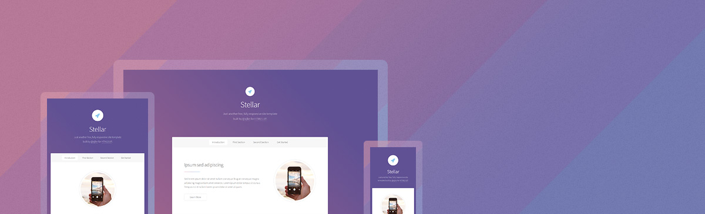

# Stellar - Jekyll theme

> A Jekyll version of the "Editorial" theme by [HTML5 UP][html5up].

You can preview the template [here](https://apehex.github.io/jekyll-theme-stellar).



# Installation

Add this line to your Jekyll site's `Gemfile`:

```ruby
gem "jekyll-theme-stellar"
```

And add this line to your Jekyll site's `_config.yml`:

```yaml
theme: jekyll-theme-stellar
```

And then execute:

    $ bundle

Or install it yourself as:

    $ gem install jekyll-theme-stellar

# Usage

For those unfamiliar with how Jekyll works, check out [jekyllrb.com](https://jekyllrb.com/) for all the details, 
or read up on just the basics of [front matter](https://jekyllrb.com/docs/frontmatter/), [writing posts](https://jekyllrb.com/docs/posts/), 
and [creating pages](https://jekyllrb.com/docs/pages/).

## Publication

To post your website as a Github page, fork this reposity and create a branch named `gh-pages`, then start editing the `_config.yml` file.

# Configuration

You can use the following custom parameters in `_config.yml`.

## Site
- `subtitle` sets the text for the lighter colored text next to your site's title.

## Social
- `500px_url`
- `facebook_url`
- `github_url`
- `gitlab_url`
- `googleplus_url`
- `instagram_url`
- `linkedin_url`
- `pinterest_url`
- `slack_url`
- `twitter_url`

## Contact
- `street_address`
- `city`
- `state`
- `zip_code`
- `country`
- `phone`
- `email`

# Contributing

Bug reports and pull requests are welcome on GitHub at https://github.com/apehex/jekyll-theme-stellar. This project is intended to be a safe, welcoming space for collaboration, and contributors are expected to adhere to the [Contributor Covenant][contributor-covenant] code of conduct.

# Development

To set up your environment to develop this theme, run `bundle install`.

Your theme is setup just like a normal Jekyll site! To test your theme, run `bundle exec jekyll serve` and open your browser at `http://localhost:4000`. This starts a Jekyll server using your theme. Add pages, documents, data, etc. like normal to test your theme's contents. As you make modifications to your theme and to your content, your site will regenerate and you should see the changes in the browser after a refresh, just like normal.

When your theme is released, only the files in `_layouts`, `_includes`, `_sass` and `assets` tracked with Git will be bundled.
To add a custom directory to your theme-gem, please edit the regexp in `jekyll-theme-stellar.gemspec` accordingly.

# Credits

Original README from HTML5 UP:

```
Stellar by HTML5 UP
html5up.net | @ajlkn
Free for personal and commercial use under the CCA 3.0 license (html5up.net/license)


Say hello to Stellar, a slick little one-pager with a super vibrant color palette (which
I guess you can always tone down if it's a little too vibrant for you), a "sticky" in-page
nav bar (powered by my Scrollex plugin), a separate generic page template (just in case
you need one), and an assortment of pre-styled elements.

Demo images* courtesy of Unsplash, a radtastic collection of CC0 (public domain) images
you can use for pretty much whatever.

(* = not included)

AJ
aj@lkn.io | @ajlkn


Credits:

    Demo Images:
        Unsplash (unsplash.com)

    Icons:
        Font Awesome (fontawesome.io)

    Other:
        jQuery (jquery.com)
        Scrollex (github.com/ajlkn/jquery.scrollex)
        Responsive Tools (github.com/ajlkn/responsive-tools)
```

Inspired by the Jekyll ports of [Andrew Banchich][andrew-banchich].

Repository [Jekyll logo][jekyll-logo] icon licensed under a [Creative Commons Attribution 4.0 International License][cc4-license].

## License

The theme is available as open source under the terms of the [CC-BY-3.0](LICENSE).

[andrew-banchich]: https://gitlab.com/andrewbanchich
[cc4-license]: http://choosealicense.com/licenses/cc-by-4.0/
[contributor-covenant]: http://contributor-covenant.org
[html5up]: https://html5up.net/
[jekyll-logo]: https://github.com/jekyll/brand
